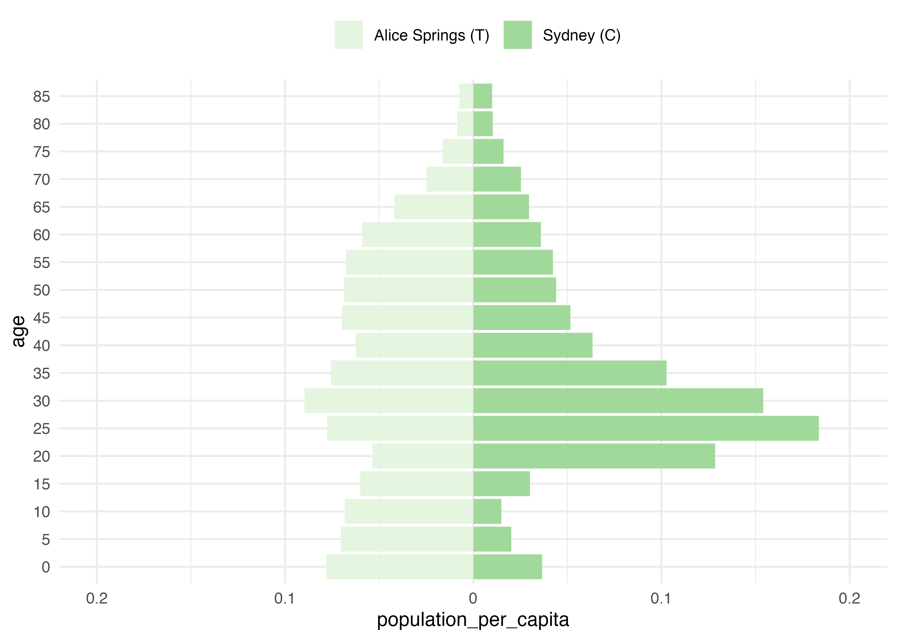
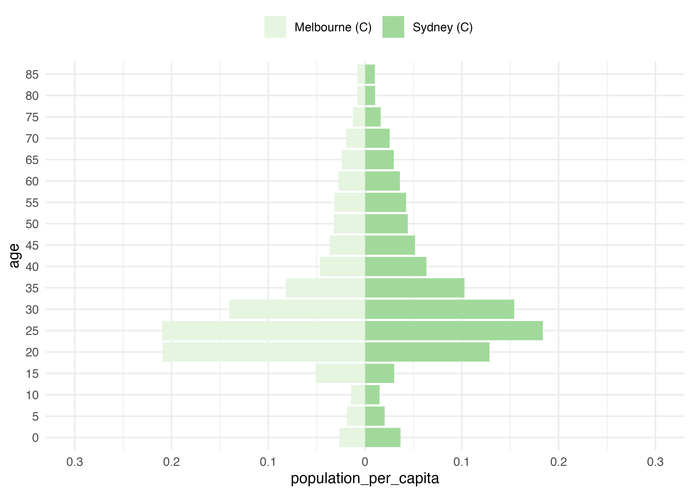
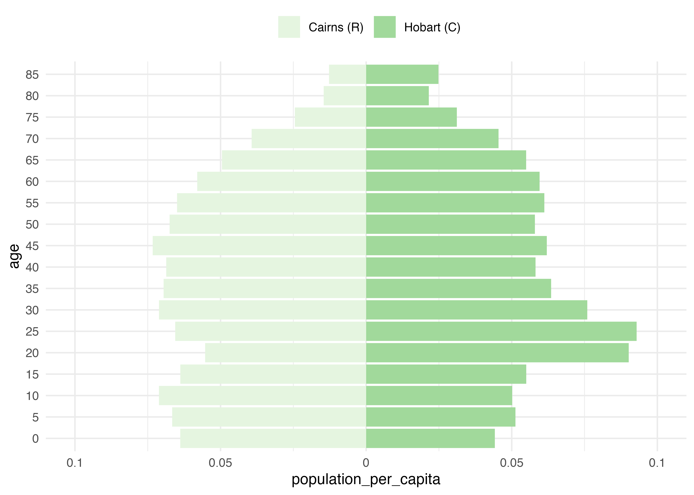
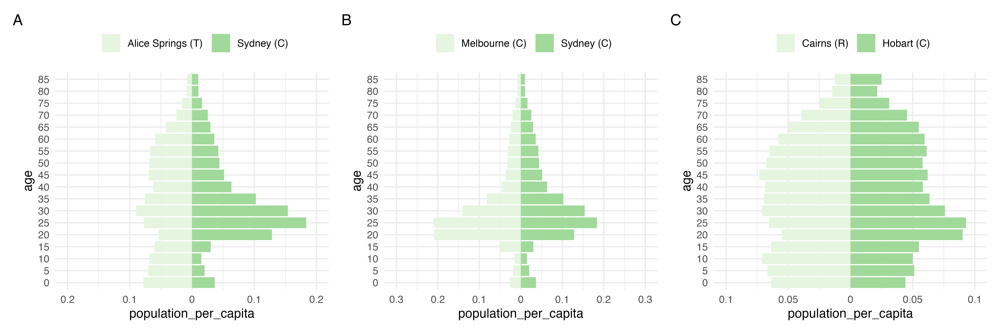

## Analysis

<!-- -->

<!-- -->

<!-- -->

<!-- -->


## Reproducibility

<details><summary>Reproducibility receipt</summary>


```
## [1] "2022-07-21 11:36:17 AWST"
```

```
## R version 4.2.0 (2022-04-22)
## Platform: aarch64-apple-darwin20 (64-bit)
## Running under: macOS Monterey 12.3.1
## 
## Matrix products: default
## BLAS:   /Library/Frameworks/R.framework/Versions/4.2-arm64/Resources/lib/libRblas.0.dylib
## LAPACK: /Library/Frameworks/R.framework/Versions/4.2-arm64/Resources/lib/libRlapack.dylib
## 
## locale:
## [1] en_AU.UTF-8/en_AU.UTF-8/en_AU.UTF-8/C/en_AU.UTF-8/en_AU.UTF-8
## 
## attached base packages:
## [1] stats     graphics  grDevices utils     datasets  methods   base     
## 
## other attached packages:
##  [1] conmat_0.0.0.9004 patchwork_1.1.1   forcats_0.5.1     stringr_1.4.0    
##  [5] dplyr_1.0.9       purrr_0.3.4       readr_2.1.2       tidyr_1.2.0      
##  [9] tibble_3.1.7      ggplot2_3.3.6     tidyverse_1.3.1   rmarkdown_2.14   
## [13] tarchetypes_0.6.0 targets_0.12.0    dotenv_1.0.3      conflicted_1.1.0 
## 
## loaded via a namespace (and not attached):
##  [1] httr_1.4.3         sass_0.4.1         jsonlite_1.8.0     here_1.0.1        
##  [5] modelr_0.1.8       bslib_0.3.1        assertthat_0.2.1   highr_0.9         
##  [9] base64url_1.4      cellranger_1.1.0   yaml_2.3.5         pillar_1.7.0      
## [13] backports_1.4.1    glue_1.6.2         digest_0.6.29      RColorBrewer_1.1-3
## [17] rvest_1.0.2        colorspace_2.0-3   htmltools_0.5.2    pkgconfig_2.0.3   
## [21] broom_0.8.0        haven_2.5.0        scales_1.2.0       processx_3.6.1    
## [25] tzdb_0.3.0         generics_0.1.2     farver_2.1.0       ellipsis_0.3.2    
## [29] cachem_1.0.6       withr_2.5.0        cli_3.3.0.9000     magrittr_2.0.3    
## [33] crayon_1.5.1       readxl_1.4.0       memoise_2.0.1      evaluate_0.15     
## [37] ps_1.7.1           fs_1.5.2           fansi_1.0.3        xml2_1.3.3        
## [41] textshaping_0.3.6  tools_4.2.0        data.table_1.14.2  hms_1.1.1         
## [45] lifecycle_1.0.1    munsell_0.5.0      reprex_2.0.1       callr_3.7.0       
## [49] compiler_4.2.0     jquerylib_0.1.4    systemfonts_1.0.4  rlang_1.0.3       
## [53] grid_4.2.0         rstudioapi_0.13    igraph_1.3.1       gtable_0.3.0      
## [57] codetools_0.2-18   DBI_1.1.2          R6_2.5.1           lubridate_1.8.0   
## [61] knitr_1.39         fastmap_1.1.0      utf8_1.2.2         rprojroot_2.0.3   
## [65] ragg_1.2.2         stringi_1.7.6      vctrs_0.4.1        dbplyr_2.1.1      
## [69] tidyselect_1.1.2   xfun_0.31
```

</details>
